# elasticSearch 是什么？工作原理是怎么样的？

现在有三段文本，id 分别是 0、1、2，你需要快速找到哪段文本里含有关键词"xiaobai".

```c
I like xiaobai        （点赞）
I follow xiaobai      （关注）
I forward the video   （转发）
```

我们很容易想到，可以依次遍历这三段文本，匹配文本内是否含有"**xiaobai**"，最终将符合条件的文本 ID 输出。
在**数据量小**的时候，问题不大，但如果我有上百亿条这样的数据呢？
如果依次遍历，这一把执行下去，比你喜欢的女生回你消息的速度，还要**慢**。
像这种在海量数据中，通过关键词检索出有效信息的场景非常常见，比如我们网购用的某宝和某东的站内商品搜索。那么问题就来了，怎么处理类似的搜索场景呢？
好办，**没有什么是加一层中间层不能解决的，如果有，那就再加一层**。
这次我们要加的中间层是 **elasticSearch**。


ES

## [什么是 elasticSearch。](#%E4%BB%80%E4%B9%88%E6%98%AF-elasticsearch%E3%80%82)

elastic Search, 也就是 es，是一个开源的搜索引擎。
它介于**应用**和**数据**之间，只要将数据写入 es，应用就可以通过一些关键词搜索到数据。效果就像某度搜索一样。
那它是怎么做到的呢？我们从倒排索引聊起。

## [什么是倒排索引](#%E4%BB%80%E4%B9%88%E6%98%AF%E5%80%92%E6%8E%92%E7%B4%A2%E5%BC%95)

回到文章开头的例子。依次遍历文本匹配是否含有"xiaobai"，确实低效。那有更高效的解法吗？
有，我们可以对文本进行切分，比如"I like xiaobai"切分为"I"、"like"、"xiaobai"三部分，这个操作叫**分词**，分词后的每部分，我们称为一个**词项**，也就是 **term**。记录词项和文本 id 的关系，于是上面的三段文本就变成了下面这样。


词项是什么


| term    | 文本 id |
| ------- | ------- |
| I       | 0, 1, 2 |
| like    | 0       |
| xiaobai | 0, 1    |
| follow  | 1       |
| forward | 2       |
| the     | 2       |
| video   | 2       |

当我们想要搜索 `xiaobai` 的时候，只需要匹配到 `xiaobai` 词项，就可以立马得到它所在的文档 id 是 0 和 1。
但这有个问题，短短三句话，就已经有这么多词项了，要是换成三篇文档，那词项就会多得离谱，怎么在这么多的词项里匹配出 xiaobai 呢？挨个遍历的话，时间复杂度就是 `O(N)`, 太低效了。

怎么办呢？
我们可以将词项**按字典序**从小到大排序，通过二分查找的方法，直接将时间复杂度优化为 `O(lgN)`。就像下面这样。


| term    | 文档 id |
| ------- | ------- |
| follow  | 1       |
| forward | 2       |
| I       | 0, 1, 2 |
| like    | 0       |
| the     | 2       |
| video   | 2       |
| xiaobai | 0, 1    |

我们将这堆排好序的词项，称为**Term Dictionary**，而词项对应的文档 id 等信息的集合，就叫 **Posting List**。它们共同构成了一个用于搜索的数据结构，它就是**倒排索引(Inverted Index)**。


倒排索引

> 注意，Posting List 其实还包含**词频**和**词项在文本里的偏移量**等信息，但为了方便理解，我在上图中去掉了这部分内容。

但倒排索引还有个问题，Term Dictionary 数据量很大，放**内存**并不现实，因此必须放在**磁盘**中。但查询磁盘是个较慢的过程。
有优化手段吗？有，我们聊下 **Term Index**。

## [Term Index 是什么](#term-index-%E6%98%AF%E4%BB%80%E4%B9%88)

我们可以发现，词项和词项之间，有些**前缀**是一致的，比如 `follow` 和 `forward` 前面的 `fo` 是一致的，如果我们将部分 term 前缀提取出来，像下图一样，就可以用更少的空间表达更多的 **term**。
基于这个原理，我们可以将 Term Dictionary 的**部分**词项提取出来，用这些 词项 的前缀信息，构建出一个**精简的目录树**。目录树的节点中存放这些词项在磁盘中的偏移量，也就是指向磁盘中的位置。这个目录树结构，体积小，适合放内存中，它就是所谓的 **Term Index**。可以用它来加速搜索。

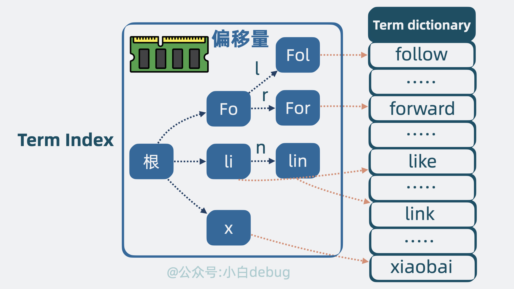
Term Index是什么

当我们需要查找某个词项的时候，只需要搜索 Term Index，就能快速获得词项在 Term Dictionary 中的大概位置。再跳转到 Term Dictionary，通过少量的检索，定位到词项内容。

## [Stored Fields 是什么](#stored-fields-%E6%98%AF%E4%BB%80%E4%B9%88)

到这里，搜索功能就有了。但有个问题，前面提到的倒排索引，搜索到的是**文档 id**，我们还需要拿着这个 id 找到**文档内容本身**，才能返回给用户。
因此还需要有个地方，存放完整的文档内容，它就是 **Stored Fields**（行式存储）。


Stored Fields

## [Doc Values 是什么](#doc-values-%E6%98%AF%E4%BB%80%E4%B9%88)

有了 id，我们就能从 Stored Fields 中取出文档内容。

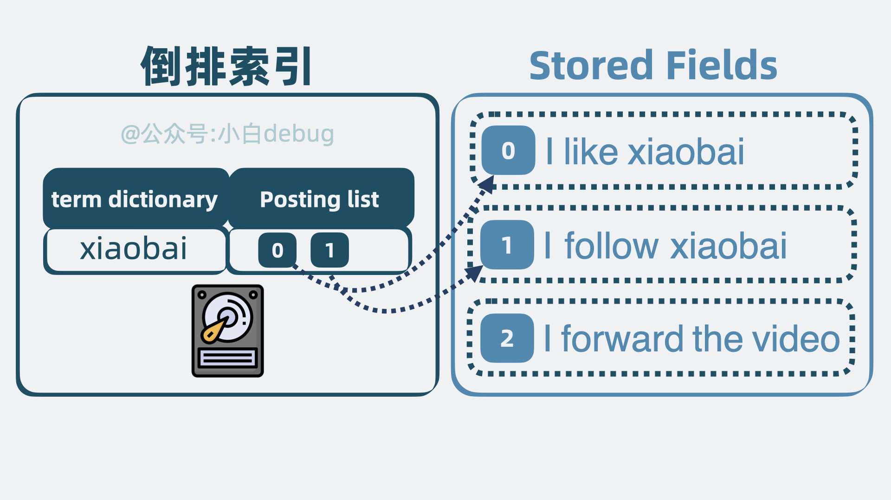
Doc Values

但用户经常需要根据某个字段排序文档，比如按时间排序或商品价格排序。但问题就来了，这些字段散落在文档里。也就是说，我们需要先获取 Stored Fields 里的文档，再提取出内部字段进行排序。
也不是说不行。但其实有更高效的做法。
我们可以用**空间换时间**的思路，再构造一个**列式存储**结构，将散落在各个文档的某个字段，**集中**存放，当我们想对某个字段排序的时候，就只需要将这些集中存放的字段一次性读取出来，就能做到针对性地进行排序。这个列式存储结构，就是所谓的 **Doc Values**。


Doc Values是什么

## [segment](#segment)

在上文中，我们介绍了四种关键的结构：**倒排索引**用于搜索，**Term Index** 用于加速搜索，**Stored Fields** 用于存放文档的原始信息，以及 **Doc Values** 用于排序和聚合。这些结构共同组成了一个**复合**文件，也就是所谓的"**segment**", 它是一个具备**完整搜索功能的最小单元**。

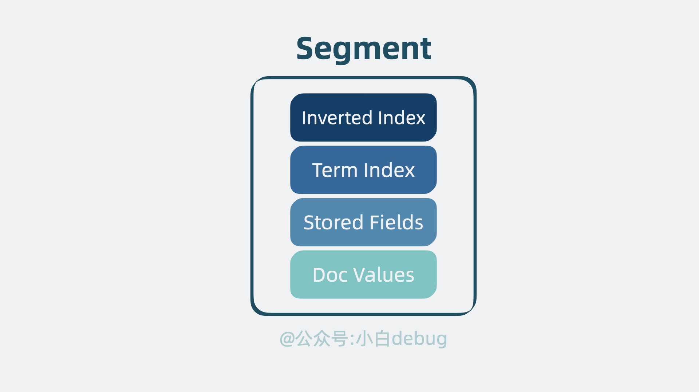
Segment是什么

## [lucene 是什么](#lucene-%E6%98%AF%E4%BB%80%E4%B9%88)

我们可以用多个文档生成一份 segment，**如果**新增文档时，还是写入到这份 segment，那就得同时更新 segment 内部的多个数据结构，这样并发读写时性能肯定会受影响。
那怎么办呢？
我们定个规矩。**segment 一旦生成，则不能再被修改**。如果还有新的文档要写入，那就生成新的 segment。
这样**老的 segment 只需要负责读，写则生成新的 segment**。同时保证了读和写的性能。

但 segment 变多了，我们怎么知道要搜索的数据在哪个 segment 里呢？
问题不大，**并发同时读**多个 segment 就好了。

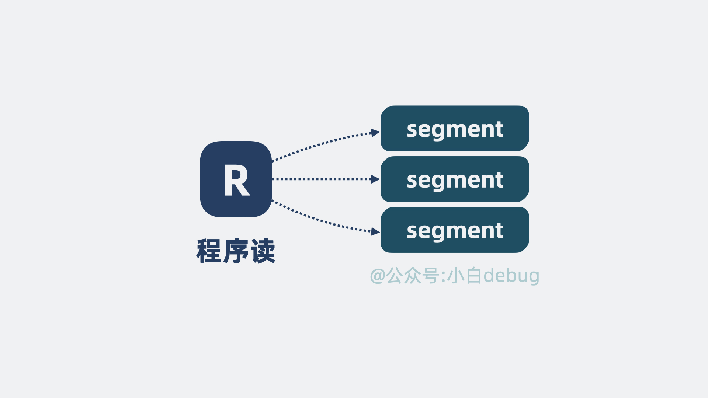
并发读

但这也引入了新问题，随着数据量增大，segment 文件越写越多，文件句柄被耗尽那是指日可待啊。
是的，但这个也好解决，我们可以不定期合并多个小 segment，变成一个大 segment，也就是**段合并**(segment merging)。这样文件数量就可控了。

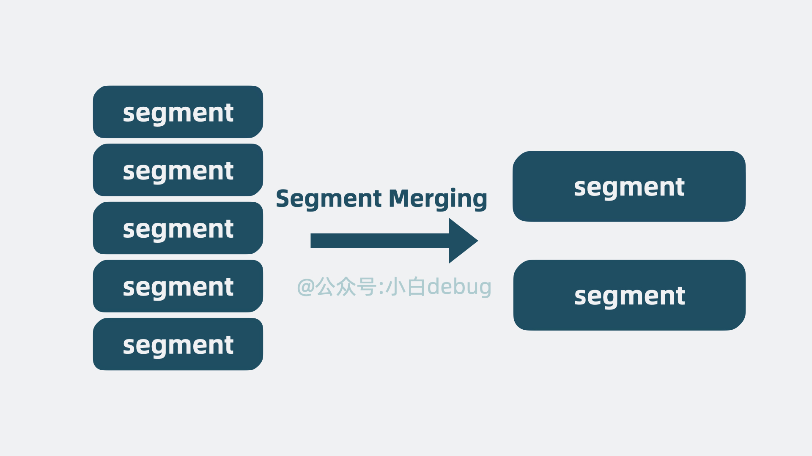
段合并

到这里，上面提到的多个 segment，就共同构成了一个**单机文本检索库**，它其实就是非常有名的开源基础搜索库 **lucene**。
不少知名搜索引擎都是基于它构建的，比如我们今天介绍的 ES。
但这个 lucene 属实过于简陋，像什么高性能，高扩展性，高可用，它是一个都不沾。
我们来看下怎么优化它。

## [高性能](#%E9%AB%98%E6%80%A7%E8%83%BD)

lucene 作为一个搜索库，可以写入大量数据，并对外提供搜索能力。
多个调用方**同时读写**同一个 lucene 必然导致争抢计算资源。抢不到资源的一方就得等待，这不纯纯浪费时间吗！
有解决方案吗？有！
首先是对写入 lucene 的数据进行分类，比如体育新闻和八卦新闻数据算两类，每一类是一个 **Index Name**，然后根据 Index Name 新增 lucene 的数量，将不同类数据写入到不同的 lucene 中，读取数据时，根据需要搜索不同的 Index Name 。这就大大降低了单个 lucene 的压力。

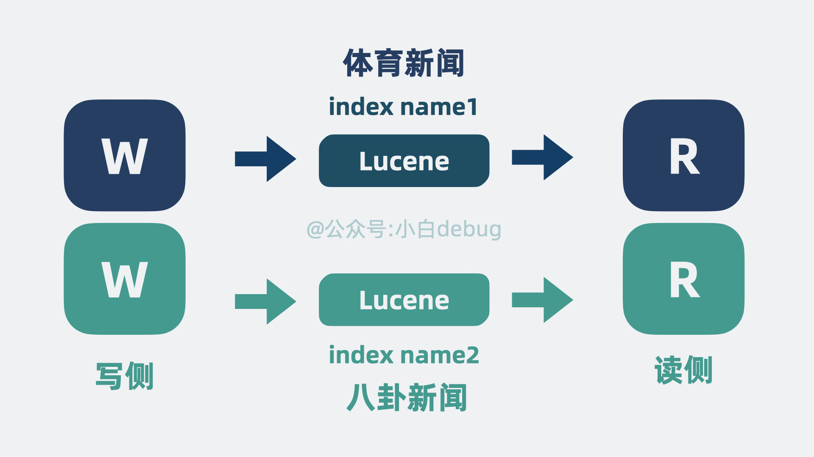
index name是什么

但单个 Index Name 内数据依然可能过多，于是可以将单个 Index Name 的同类数据，拆成好几份，每份是一个 **shard 分片**，**每个 shard 分片本质上就是一个独立的 lucene 库**。
这样我们就可以将读写操作分摊到多个 分片 中去，大大降低了争抢，提升了系统性能。


Shard是什么

## [高扩展性](#%E9%AB%98%E6%89%A9%E5%B1%95%E6%80%A7)

随着 分片 变多，如果 分片 都在同一台机器上的话，就会导致单机 cpu 和内存过高，影响整体系统性能。

于是我们可以申请更多的机器，将 分片 **分散**部署在多台机器上，这每一台机器，就是一个 **Node**。我们可以通过增加 Node 缓解机器 cpu 过高带来的性能问题。

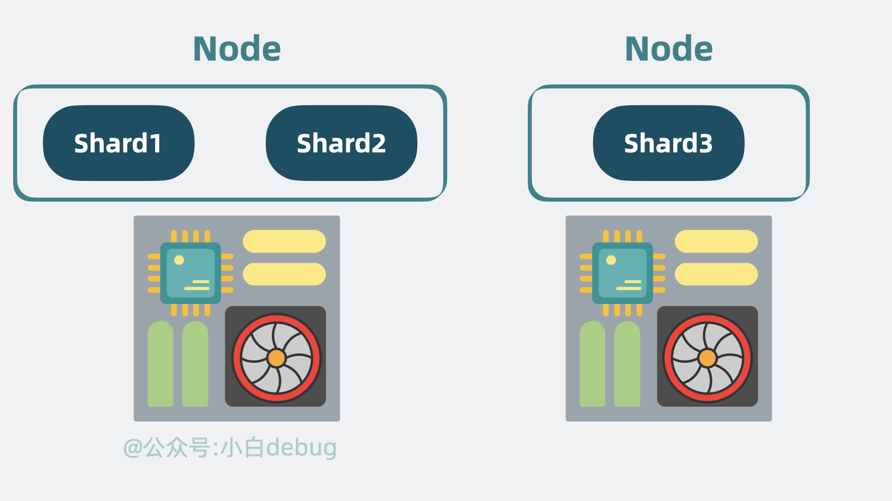
高扩展性

## [高可用](#%E9%AB%98%E5%8F%AF%E7%94%A8)

到这里，问题又又来了，如果其中一个 Node 挂了，那 Node 里所有分片 都无法对外提供服务了。我们需要保证服务的高可用。有解决方案吗？
有，我们可以给 分片 **多加几个副本**。将 分片 分为 **Primary shard** 和 **Replica shard**，也就是主分片和副本分片 。主分片会将数据同步给副本分片，副本分片**既可以**同时提供读操作，**还能**在主分片挂了的时候，升级成新的主分片让系统保持正常运行，**提高性能**的同时，还保证了系统的**高可用**。


主分片和副本分片

## [Node 角色分化](#node-%E8%A7%92%E8%89%B2%E5%88%86%E5%8C%96)

搜索架构需要支持的功能很多，既要负责**管理集群**，又要**存储管理数据**，还要**处理客户端的搜索请求**。如果每个 Node **都**支持这几类功能，那当集群有数据压力，需要扩容 Node 时，就会**顺带**把其他能力也一起扩容，但其实其他能力完全够用，不需要跟着扩容，这就有些**浪费**了。
因此我们可以将这几类功能拆开，给集群里的 Node 赋予**角色身份**，不同的角色负责不同的功能。
比如负责管理集群的，叫**主节点(Master Node)**， 负责存储管理数据的，叫**数据节点(Data Node)**， 负责接受客户端搜索查询请求的叫**协调节点(Coordinate Node)**。
集群规模小的时候，一个 Node 可以**同时**充当多个角色，随着集群规模变大，可以让一个 Node 一个角色。

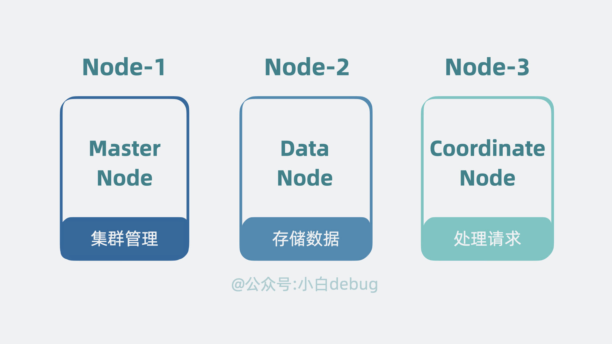
角色分化

## [去中心化](#%E5%8E%BB%E4%B8%AD%E5%BF%83%E5%8C%96)

上面提到了主节点，那就意味着还有个**选主**的过程，但现在每个 Node 都是独立的，需要有个机制协调 Node 间的数据。
我们很容易想到，可以像 `kafka` 那样引入一个中心节点 `Zookeeper`，但如果不想引入新节点，还有其他更轻量的方案吗？
有，**去中心化**。
我们可以在 Node 间引入协调模块，用**类似一致性算法 Raft** 的方式，在节点间互相同步数据，让所有 Node 看到的集群数据状态都是一致的。这样，集群内的 Node 就能参与选主过程，还能了解到集群内某个 Node 是不是挂了等信息。

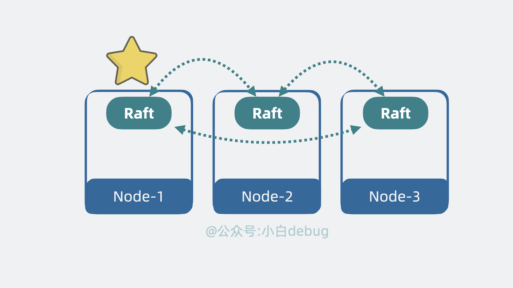
去中心化

## [ES 是什么？](#es-%E6%98%AF%E4%BB%80%E4%B9%88)

好了，到这里，当初那个简陋的 lucene，就成了一个高性能，高扩展性，高可用，支持持久化的分布式搜索引擎，它就是我们常说的 **elastic search**，简称 **ES**。它对外提供 `http` 接口，任何语言的客户端都可以通过 HTTP 接口接入 es，实现对数据的增删改查。
从架构角度来看，es 给了一套方案，告诉我们如何让一个**单机系统 lucene** 变成一个**分布式系统**。


ES是什么

按这个思路，是不是也可以将 lucene 改成其他单机系统，比如 `mysql` 数据库，或者专门做向量检索的单机引擎 `faiss`？
那以后再来个 `elastic mysql` 或者 `elastic faiss` 是不是就不那么意外了，大厂内卷晋升或者下一个明星开源大项目的小提示就给到这里了。

看完 es 的架构，是不是觉得有些**似曾相识**？
没错，我说的就是我前两期聊过的 `kafka`。

## [ES 和 Kafka 的架构差异](#es-%E5%92%8C-kafka-%E7%9A%84%E6%9E%B6%E6%9E%84%E5%B7%AE%E5%BC%82)

如果你不了解 kakfa 的架构，可以看下我之前写的《**Kafka 是什么？**》。
然后你就会发现：

* es 中用于分类消息的 `Index Name`，其实就是 kafka 的 `topic`。
* es 中用于对 Index Name 数据分片的 `Shard`，其实就是 kafka 中拆分 topic 数据的 `Partition`。
* es 中用于分散部署多个 shard 的 `Node`, 其实就相当于 kafka 中的 `broker`。

es 的架构跟 kafka 以及我们上期聊过的 rocketMQ 都非常相似，**果然优秀的架构都是相似的，丑陋的架构各有各的丑陋**。学一套优秀架构，就等于弄通了好几个中间件原理，简直血赚！

现在我们了解完 es 的架构，再来用两个实际例子将这些概念串起来，浅看下它的工作原理。

## [ES 的写入流程](#es-%E7%9A%84%E5%86%99%E5%85%A5%E6%B5%81%E7%A8%8B)

* 当**客户端应用**发起数据**写入**请求，请求会先发到集群中**协调节点**。
* 协调节点根据 hash 路由，判断数据该写入到哪个**数据节点**里的哪个**分片**(Shard)，找到**主分片**并写入。分片底层是 **lucene**，所以最终是将数据写入到 lucene 库里的 **segment** 内，将数据固化为**倒排索引**和 **Stored Fields** 以及 **Doc Values** 等多种结构。
* 主分片 写入成功后会将数据同步给 **副本分片**。
* 副本分片 写入完成后，**主分片**会响应协调节点一个 ACK，意思是写入完成。
* 最后，**协调节点**响应**客户端应用**写入完成。

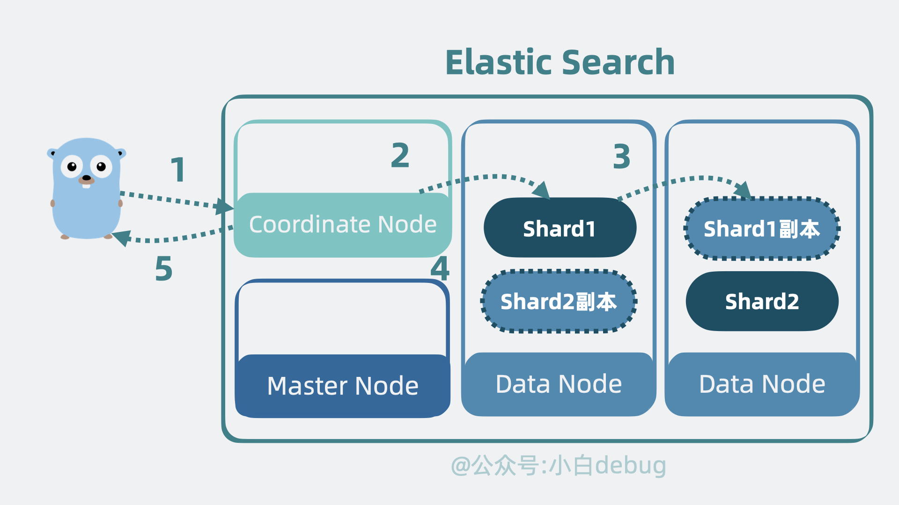
写入流程

## [ES 的搜索流程](#es-%E7%9A%84%E6%90%9C%E7%B4%A2%E6%B5%81%E7%A8%8B)

ES 的搜索流程分为两个阶段：分别是**查询阶段（Query Phase）**和**获取阶段（Fetch Phase）**
我们分别看下。

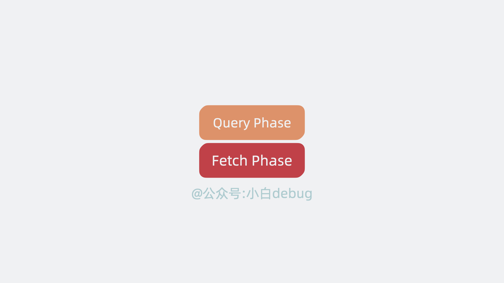
搜索两阶段

### [查询阶段。](#%E6%9F%A5%E8%AF%A2%E9%98%B6%E6%AE%B5%E3%80%82)

* 当**客户端应用**发起**搜索**请求，请求会先发到集群中的**协调节点**。
* 协调节点根据 **index name** 的信息，可以了解到 index name 被分为了几个 **分片**，以及这些分片 分散哪个**数据节点**上，将请求转发到这些数据节点的 分片 上面。
* 搜索请求到达分片后，分片 底层的 lucene 库会**并发**搜索多个 **segment**，利用每个 segment 内部的**倒排索引**获取到对应**文档 id**，并结合 **doc values** 获得**排序信息**。分片将结果聚合返回给**协调节点**。
* **协调节点**对多个分片中拿到的数据进行**一次排序聚合**，**舍弃**大部分不需要的数据。


查询阶段

### [获取阶段。](#%E8%8E%B7%E5%8F%96%E9%98%B6%E6%AE%B5%E3%80%82)

* **协调节点**再次拿着**文档 id** 请求**数据节点**里的 **分片**，分片 底层的 lucene 库会从 segment 内的 **Stored Fields** 中取出**完整文档内容**，并返回给协调节点。
* **协调节点**最终将数据结果返回给**客户端**。完成整个搜索过程。


获取阶段

现在大家通了吗？

## [总结](#%E6%80%BB%E7%BB%93)

* lucene 是 es 底层的单机文本检索库，它由多个 segment 组成，每个 segment 其实是由倒排索引、Term Index、Stored Fields 和 Doc Values 组成的具备完整搜索功能的最小单元。
* 将数据分类，存储在 es 内不同的 Index Name 中。
* 为了防止 Index Name 内数据过多，引入了 Shard 的概念对数据进行分片。提升了性能。
* 将多个 shard 分布在多个 Node 上，根据需要对 Node 进行扩容，提升扩展性。
* 将 shard 分为主分片和副本分片，主分片挂了之后由副本分片顶上，提升系统的可用性。
* 对 Node 进行角色分化，提高系统的性能和资源利用率，同时简化扩展和维护。
* es 和 kafka 的架构非常像，可以类比学习。
