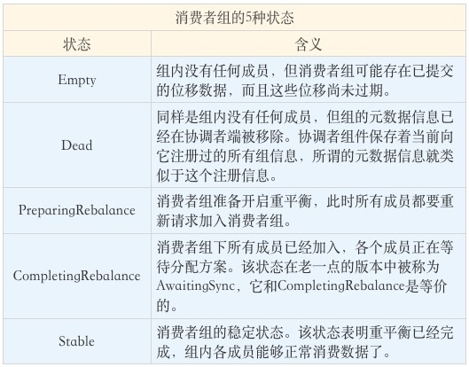
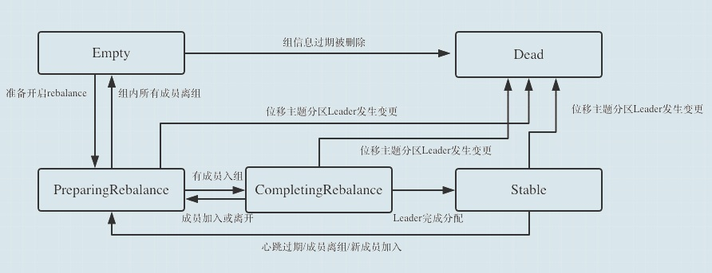
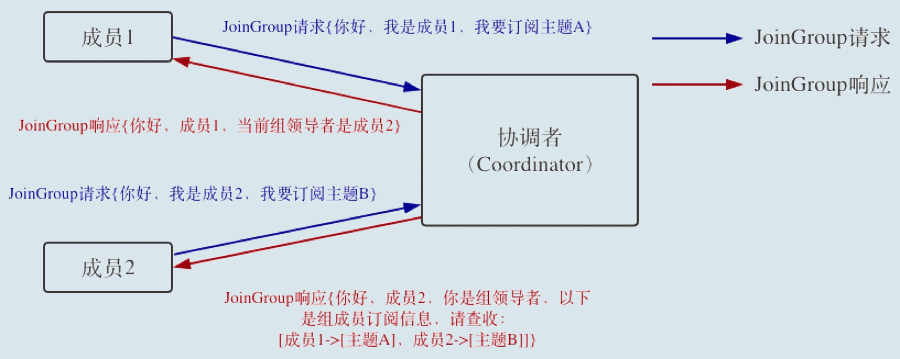
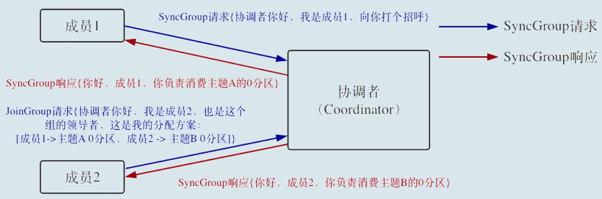
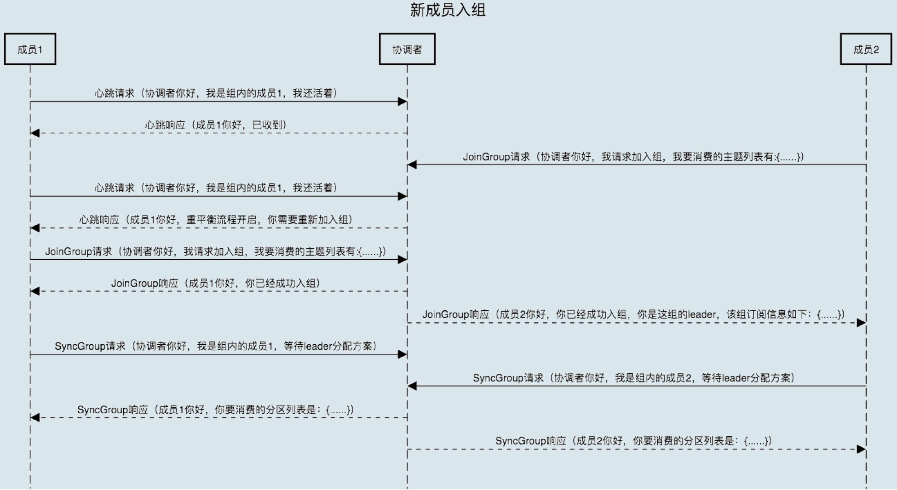
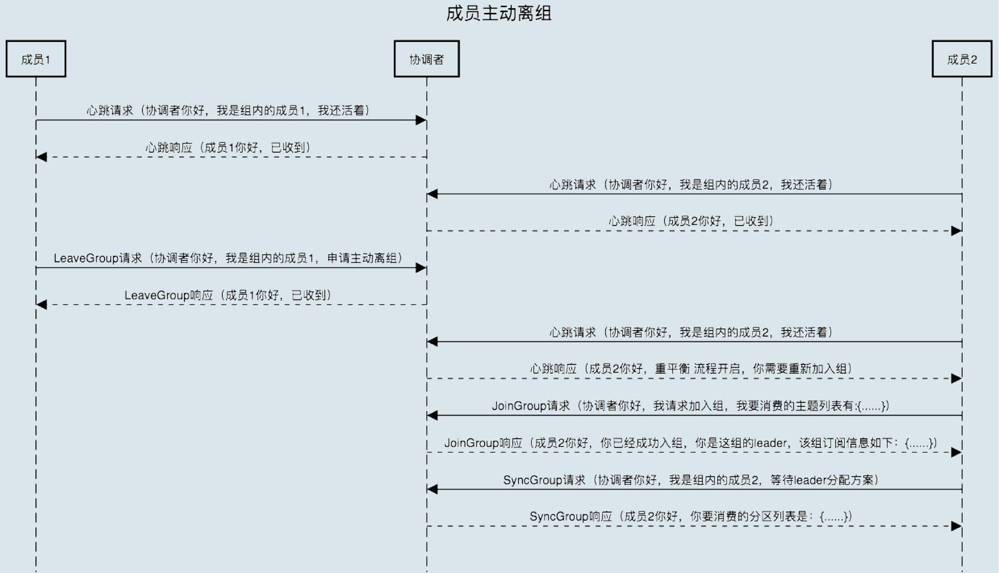
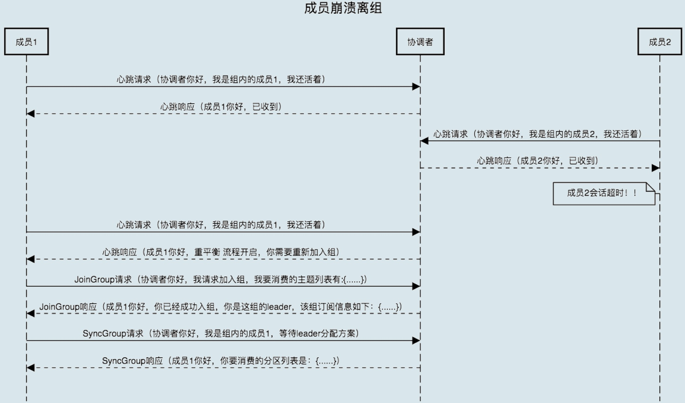
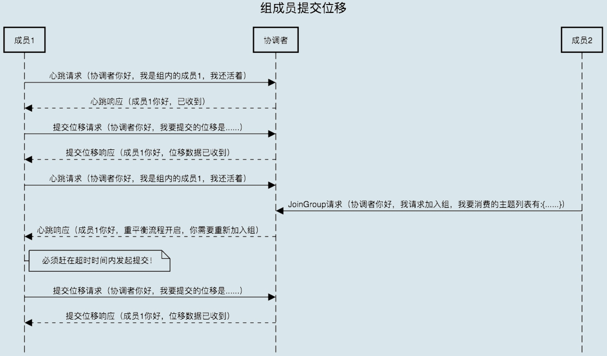

## 前言

1. 重平衡是什么？为什么要了解他？
2. 发生重平衡的时机
3. **Kafka**的心跳机制 与 Rebalance
4. 消费者组状态切换
5. 重平衡全流程解析

### 重平衡是什么？为什么要了解他？

* 重平衡是什么  Rebalance（重平衡 ）本质上是一种协议，  规定了一个Consumer Group下的所有 Consumer 如何达成一致，  来分配订阅Topic的每个分区。  说简单点就是 给消费组每个消费者分配消费任务的过程。
* 为什么要了解他？  Rebalance是启动一个消费者组必经的过程，  当然这不是最主要的，最主要的是，在消费的过程中，  在某些情况下会导致这个过程再次发生，  带来的后果就是整个集群暂时性的瘫痪，  严重影响到Kafka的高可用

### 发生重平衡的时机

那么 Rebalance 会在什么时候发生呢？

1. 订阅主题数发生变化  这种情况一般不会发生，  如果发生，那也是因为我们的业务调整才会，  所以这种基本要么不发生要么就是不可避免。
2. 主题分区发生变化  这种情况发生会相对多一点，但是也有限，  在部署Kafka集群前，  我们就需要考虑到该集群的容量，  以便来确定好分区数。  虽然不一定一步到位，  但是调整的次数应该是极其有限的，  一般也可以选择在半夜低峰的时候进行调整，影响不大。
3. 消费端的消费者组成员变化  基本上影响最大的就是这个原因了，  为什么这么说呢？  我们考虑下什么时候消费者组的成员会发生变化就能大概了解了。
   * 消费者处理消息超时，  即如果消费者处理消费的消息的时间超过了  Kafka集群配置的 `max.poll.interval.ms` 的值，  那么该消费者将会自动离组
   * 心跳超时，  如果消费者在指定的`session.timeout.ms`时间内没有汇报心跳，  那么Kafka就会认为该消费已经dead了

可以看出，消费端的消费者组成员变化一般都是由于异常引起的，  所以其产生的 Rebalance 也是最难控制的。

### Kafka的心跳机制 与 Rebalance

Kafka的心跳机制 与 Rebalance 有什么关系呢？ 
事实上，重平衡过程是靠消费者端的心跳线程（Heartbeat Thread）通知到其他消费者实例的  
每当消费者向其 coordinator 汇报心跳的时候，  
如果这个时候 coordinator 决定开启 Rebalance ，  
那么 coordinator 会将`REBALANCE_IN_PROGRESS`封装到心跳的响应中， 
当消费者接受到这个`REBALANCE_IN_PROGRESS`，他就知道需要开启新的一轮 Rebalance  了,  
所以`heartbeat.interval.ms`除了是设置心跳的间隔时间，  其实也意味着 Rebalance 感知速度，  
心跳越快，那么 Rebalance 就能更快的被各个消费者感知。

在 Kafka 0.10.1.0 版本之前，  发送心跳请求是在消费者主线程完成的，  也就是你写代码调用`KafkaConsumer.poll`方法的那个线程。  这样做有诸多弊病，最大的问题在于，消息处理逻辑也是在这个线程中完成的。  因此，一旦消息处理消耗了过长的时间，  心跳请求将无法及时发到协调者那里，  导致协调者“错误地”认为该消费者已“死”。  自 0.10.1.0 版本开始，  社区引入了一个单独的心跳线程来专门执行心跳请求发送，避免了这个问题。

### 消费者组状态切换

为什么要了解 消费者组状态 呢？

这里主要是为了方便讲解 Rebalance 流程，  所以你需要大概了解一下消费者组的状态切换，  如下图：

其流转过程大概如下：

一个消费者组最开始是Empty状态，
当重平衡过程开启后，
它会被置于PreparingRebalance状态 等待成员加入，
成员都加入之后变更到CompletingRebalance状态等待分配方案，
当coordinator分配完个消费者消费的分区后，
最后就流转到Stable状态完成重平衡。
当有新成员加入或已有成员退出时，
消费者组的状态 从Stable直接跳到PreparingRebalance状态，
此时，所有现存成员就必须重新申请加入组。
当所有成员都退出组后，消费者组状态变更为Empty。

Kafka定期自动删除过期位移的条件就是，组要处于Empty状态。
因此，如果你的消费者组停掉了很长时间（超过7天），
那么Kafka很可能就把该组的位移数据删除了。

### **消费者端重平衡流程**

在消费者端，重平衡分为两个步骤：

1. 加入组。
   当组内成员加入组时，它会向 coordinator 发送JoinGroup请求。
   在该请求中，每个成员都要将自己订阅的主题上报，
   这样协调者就能收集到所有成员的订阅信息。
   一旦收集了全部成员的JoinGroup请求后，
   Coordinator 会从这些成员中选择一个担任这个消费者组的领导者。
   通常情况下，第一个发送JoinGroup请求的成员自动成为领导者。
   领导者消费者的任务是收集所有成员的订阅信息，
   然后根据这些信息，制定具体的分区消费分配方案。 
   **特别注意的是：这里说的是消费者领导者。**  
   选出领导者之后，
   Coordinator 会把消费者组订阅信息封装进JoinGroup请求的 响应体中，
   然后发给领导者，由领导者统一做出分配方案后，
   进入到下一步：发送SyncGroup请求。
   如下图就是 JoinGroup 的全过程
   
2. 领导者消费者（Leader Consumer）分配方案 。
   领导者向 Coordinator 发送SyncGroup请求，
   将刚刚做出的分配方案发给协调者。
   值得注意的是，其他成员也会向 Coordinator 发送SyncGroup请求，
   只不过请求体中并没有实际的内容。这一步的主要目的是让 Coordinator 接收分配方案，
   然后统一以 SyncGroup 响应的方式分发给所有成员，
   **这样组内所有成员就都知道自己该消费哪些分区了。**  如下图：
   

消费者端重平衡流程 大概就这样了，下面我们再来看看：Broker端重平衡

### Broker端重平衡

要剖析协调者端处理重平衡的全流程，  我们必须要分几个场景来讨论。  这几个场景分别是

* 新成员加入组
* 组成员主动离组
* 组成员崩溃离组
* 组成员提交位移。

接下来，我们一个一个来讨论。

* 新成员入组。 
  新成员入组是指组处于Stable状态后，有新成员加入。 
  如果是全新启动一个消费者组，Kafka是有一些自己的小优化的，流程上会有些许的不同。 
  我们这里讨论的是，组稳定了之后有新成员加入的情形。 
  当协调者收到新的JoinGroup请求后， 
  它会通过心跳请求响应的方式通知组内现有的所有成员，
  强制它们开启新一轮的重平衡。  具体的过程和之前的客户端重平衡流程是一样的。  
  现在，我用一张时序图来说明协调者一端是如何处理新成员入组的。
  

* 组成员主动离组。
  何谓主动离组？就是指消费者实例所在线程或进程调用close()方法主动通知协调者它要退出。
  这个场景就涉及到了第三类请求：LeaveGroup请求。
  协调者收到LeaveGroup请求后，依然会以心跳响应的方式通知其他成员，
  因此我就不再赘述了，还是直接用一张图来说明。
  

* 组成员崩溃离组。
  崩溃离组是指消费者实例出现严重故障，突然宕机导致的离组。
  它和主动离组是有区别的，
  因为后者是主动发起的离组，协调者能马上感知并处理。
  但崩溃离组是被动的，协调者通常需要等待一段时间才能感知到，
  这段时间一般是由消费者端参数session.timeout.ms控制的。
  也就是说，Kafka一般不会超过session.timeout.ms就能感知到这个崩溃。
  当然，后面处理崩溃离组的流程与之前是一样的，我们来看看下面这张图。
  

* 重平衡时协调者对组内成员提交位移的处理。
  正常情况下，每个组内成员都会定期汇报位移给协调者。
  当重平衡开启时，协调者会给予成员一段缓冲时间，
  要求每个成员必须在这段时间内快速地上报自己的位移信息，
  然后再开启正常的JoinGroup/SyncGroup请求发送。
  还是老办法，我们使用一张图来说明。
  

### 总结

其实不论哪种方式，都是差不多的流程，这里放开举例，最主要的还是为了更加清晰，如果发生类似的问题，可以很快的从上面这些可能入手。

基本流程就是 Coordinator 感知到 消费者组的变化，
然后在心跳的过程中发送重平衡信号通知各个消费者离组，
然后消费者重新以 JoinGroup 方式加入 Coordinator，并选出Consumer Leader。
当所有消费者加入 Coordinator，
Consumer Leader会根据 Coordinator给予的分区信息给出分区方案。
Coordinator 将该方案以 SyncGroup 的方式将该方案执行下去，通知各个消费者，
这样就完成了一轮 重平衡了。

