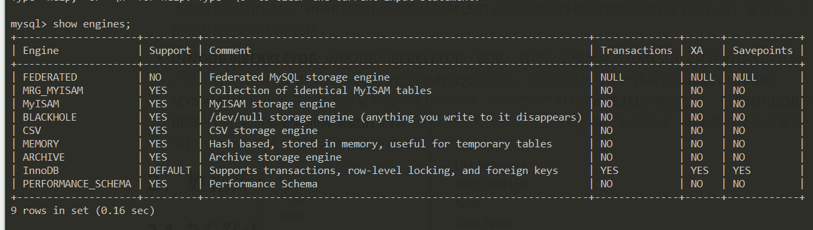
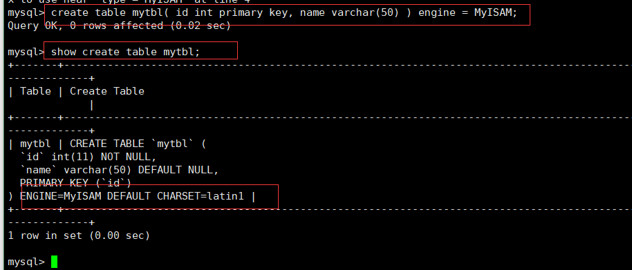
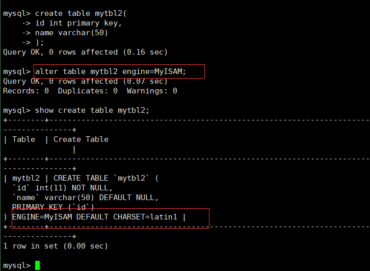
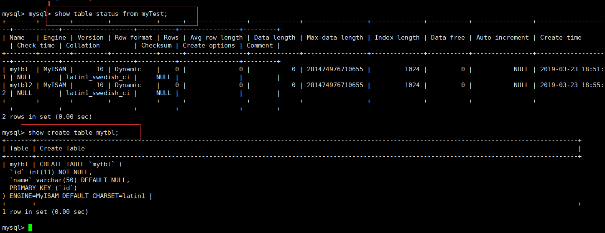
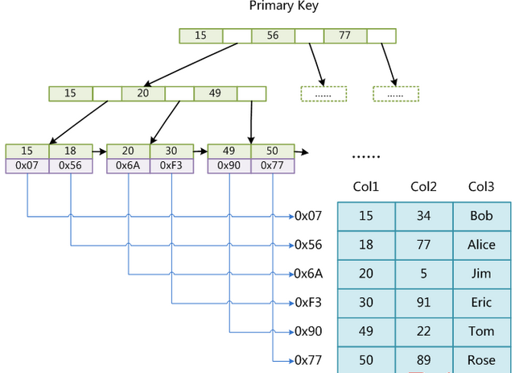
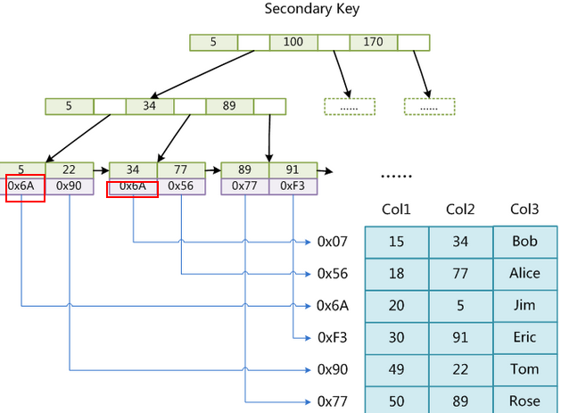
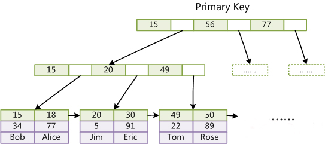
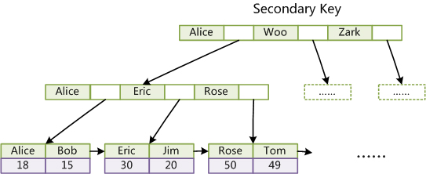

# MySQL 存储引擎

## 1、数据库引擎类别

​	我们能使用的数据库引擎取决于mysql在安装的时候是如何被编译的。要添加一个新的引擎，就必须重新编译MSQL。在缺省（默认）情况下，mysql支持三个引擎： ISAM、MYISAM、HEAP。另外两种类型INNODB和BERKLEY(BDB),也常常可以使用。

- **ISAM:**  是一个定义明确且历经时间考验的数据表格管理方法，它在设计之时就考虑到数据库被查询的次数要远大于更新的次数。因此ISAM执行读取速度很快，而且不占用大量的内存和存贮资源。ISAM的**两个不足之处** 在于，他不支持事物处理，也不能够容错：如果你的硬盘崩溃了，那么数据文件就无法恢复了。如果你正在把ISAM用在关键任务应用进程，那就必须经常备份你所有的实时数据，通过其复制特性，MYSQL能够支持这样的备份应用程序
- **MYISAM:** 是MySQL的ISAM拓展格式和缺省（默认）的数据库引擎。除了提供ISAM里所没有的索引和字段管理的功能，MYISAM还是用一种表格锁定的机制，来优化多个并发的读写操作。其代价是你需要经常运行OPTIMIZE TABLE命令，来恢复被更新机制所浪费的空间。MYISAM还有一些有用的拓展，例如用来修复数据库文件的MYISAMCHK工具和用来恢复浪费空间的MYISMPACK工具。MYISAM强调了快速读取操作，这可能就是为什么MYSQL受到了WEB开发如此青睐的主要原因：在WEB开发中你所进行的大量数据操作都是读取操作。所以，大多数虚拟主机提供商和internet平台提供商只允许使用MYISAM格式。
- **HEAP:** 允许只驻留在内存里的临时表格。驻留在内存里让HEAP要比ISAM和MYISAM都快，但是它所管理的数据都是不稳定的，而且如果在关机之前没有保存，那么所有数据都会丢失。在数据行被删除的时候，HEAP也不会浪费大量的空间，HEAP表格在你需要使用SELECT表达式来选择和操控数据的时候非常有用。要记住，在用完表格之后就删除表格。
- **INNODB和BERKLEYDB:** INNODB和BERKLEYDB（BDB）数据库引擎都是造就MYSQL灵活性的技术的直接产品，这项技术就是MYSQL++ API。在使用MYSQL的时候，你所面对的每一个挑战几乎都源于ISAM和MYISAM数据库引擎不支持事务处理也不支持外来键。尽管要比ISAM和MYISAM引擎慢很多，但是INNODB和BDB包括了**对事务处理和外来键的支持**，这两点都是前两个引擎所没有的。如前所述，如果你的设计需要这些特性中的一者或者两者，那你就要被迫使用后两个引擎中的一个了。

## 2、数据库引擎更换方式

### 2.1 查看默认引擎



### 2.3 更换数据库引擎

- 更改方式1： **修改配置文件 my.ini**(linux 中修改mysqld.cnf )

  在[mysqld]后面添加default-storage-engine=InnoDB，重启服务，数据库默认的引擎修改为InnoDB;


- 更改方式2：**在建表的时候指定**：

  ```mysql
  create table mytbl(   
      id int primary key,   
      name varchar(50)   
  )engine=MyISAM;
  ```

  

  ​


- 更改方式3： **建表后修改**

  ```mysql
  alter table mytbl2 type = InnoDB;
  ```

  

  ​


- 查看修改结果方式

  ```mysql
  show table status from database_name; 
  ```

  ```mysql
  show create table table_name
  ```

  

## 3、MyISAM 和Innodb引擎详解

### 3.1 Innodb引擎

​	**InnoDB是MySQL的默认数据库引擎（5.5版之后）**，2006年五月时由甲骨文公司并购。与传统的ISAM与MyISAM相比，InnoDB的最大特色就是支持了ACID兼容的事务（Transaction）功能。

​	Innodb引擎提供了对数据库ACID**事务**的支持，并且实现了SQL标准的四种隔离级别，该引擎还提供了行级锁和外键约束，它的设计目标是处理大容量数据库系统，它本身其实就是基于MySQL后台的完整数据库系统，MySQL运行时Innodb会在内存中建立缓冲池，用于缓冲数据和索引。但是该引擎不支持FULLTEXT类型的索引，而且它没有保存表的行数，当SELECT COUNT(*) FROM TABLE时需要扫描全表。当需要使用数据库事务时，该引擎当然是首选。由于锁的粒度更小，写操作不会锁定全表，所以在并发较高时，使用Innodb引擎会提升效率。但是使用行级锁也不是绝对的，如果在执行一个SQL语句时MySQL不能确定要扫描的范围，InnoDB表同样会锁全表。是MySQL默认引擎

**特点：**

- **支持行锁**，采用MVCC来支持高并发，有可能死锁
- **支持事务**
- **支持外键**
- **支持崩溃后的安全恢复**
- **不支持全文索引**

### 3.2 MyISAM引擎

​	它没有提供对数据库事务的支持，也不支持行级锁和外键，因此当INSERT(插入)或UPDATE(更新)数据时即写操作需要锁定整个表，效率便会低一些。不过和Innodb不同，MyIASM中存储了表的行数，于是SELECT COUNT(*) FROM TABLE时只需要直接读取已经保存好的值而不需要进行全表扫描。如果表的读操作远远多于写操作且不需要数据库事务的支持，那么MyIASM也是很好的选择。

​	**MyISAM是MySQL的默认数据库引擎（5.5版之前）**，由早期的 **ISAM** （Indexed Sequential Access Method：有索引的顺序访问方法）所改良。虽然性能极佳，而且提供了大量的特性，包括全文索引、压缩、空间函数等，但MyISAM不支持事务和行级锁，而且最大的缺陷就是崩溃后无法安全恢复。不过，5.5版本之后，MySQL引入了InnoDB（另一种数据库引擎）。

​	下面这张图只是想表达的意思是现在大多数时候我们使用的都是InnoDB存储引擎，但是在某些情况下使用MyISAM更好，比如：**MyISAM更适合读密集的表，而InnoDB更适合写密集的的表。** 在数据库做主从分离的情况下，经常选择MyISAM作为主库的存储引擎。


**特点** 

- **不支持行锁(MyISAM只有表锁)**，读取时对需要读到的所有表加锁，写入时则对表加排他锁；
- **不支持事务**
- **不支持外键**
- **不支持崩溃后的安全恢复**
- 在表有读取查询的同时，支持往表中插入新纪录
- 支持BLOB和TEXT的前500个字符索引，**支持全文索引**
- **支持延迟更新索引**，极大地提升了写入性能
- 对于不会进行修改的表，支持 **压缩表** ，极大地减少了磁盘空间的占用

> **Mysql的行锁和表锁（ 锁是计算机协调多个进程或纯线程并发访问某一资源的机制）**
> **表级锁：** 每次操作锁住整张表。开销小，加锁快；不会出现死锁；锁定粒度大，发生锁冲突的概率最高，并发度最低；
> **行级锁：** 每次操作锁住一行数据。开销大，加锁慢；会出现死锁；锁定粒度最小，发生锁冲突的概率最低，并发度也最高；

### 3.3 两种引擎选择

​	**MyISAM更适合读密集的表，而InnoDB更适合写密集的的表。** 在数据库做主从分离的情况下，经常选择MyISAM作为主库的存储引擎。

一般来说，如果需要事务支持，并且有较高的并发读取频率(MyISAM的表锁的粒度太大，所以当该表写并发量较高时，要等待的查询就会很多了)，InnoDB是不错的选择。如果你的数据量很大（MyISAM支持压缩特性可以减少磁盘的空间占用），而且不需要支持事务时，MyISAM是最好的选择。

**常见对比**

**1) count运算上的区别：** 因为MyISAM缓存有表meta-data（行数等），因此在做COUNT(*)时对于一个结构很好的查询是不需要消耗多少资源的。而对于InnoDB来说，则没有这种缓存。

**2) 是否支持事务和崩溃后的安全恢复： MyISAM** 强调的是性能，每次查询具有原子性,其执行数度比InnoDB类型更快，但是不提供事务支持。但是**InnoDB** 提供事务支持事务，外部键等高级数据库功能。 具有事务(commit)、回滚(rollback)和崩溃修复能力(crash recovery capabilities)的事务安全(transaction-safe (ACID compliant))型表。

**3)是否支持外键：** MyISAM不支持，而InnoDB支持。


## 4、索引

​	**索引**（Index）是**帮助MySQL高效获取数据的数据结构**。MyIASM和Innodb都使用了树这种数据结构做为索引。下面我接着讲这两种引擎使用的索引结构，讲到这里，首先应该谈一下B-Tree和其变种B+Tree。

### 4.1 MyISAM 引擎索引结构

​	MyISAM引擎的索引结构为B+Tree,其中B+Tree的数据域存储的内容为实际数据的地址。也就是说它的索引和实际的数据是分开的，只不过是用索引指向了实际的数据，这种索引就是所谓的**非聚集索引**。如下图所示：



　这里设表一共有三列，假设我们以Col1为主键，则上图是一个MyISAM表的主索引（Primary key）示意。可以看出MyISAM的索引文件仅仅保存数据记录的地址。在MyISAM中，主索引和辅助索引（Secondary key）在结构上没有任何区别，只是主索引要求key是唯一的，而辅助索引的key可以重复。如果我们在Col2上建立一个辅助索引，则此索引的结构如下图所示：



同样也是一颗B+Tree，data域保存数据记录的地址。因此，MyISAM中索引检索的算法为首先按照B+Tree搜索算法搜索索引，如果指定的Key存在，则取出其data域的值，然后以data域的值为地址，读取相应数据记录。

### 4.2 Innodb引擎索引结构

​	与MyISAM引擎的索引结构同样也是B+Tree，但是Innodb的索引文件本身就是数据文件，即**B+Tree的数据域存储的就是实际的数据**，这种索引就是**聚集索引**。这个索引的key就是数据表的主键，因此InnoDB表数据文件本身就是主索引。

​	并且和MyISAM不同，InnoDB的**辅助索引数据域存储的也是相应记录主键的值**而不是地址，所以当以辅助索引查找时，会先根据辅助索引找到主键，再根据主键索引找到实际的数据。所以Innodb不建议使用过长的主键，否则会使辅助索引变得过大。建议使用自增的字段作为主键，这样B+Tree的每一个结点都会被顺序的填满，而不会频繁的分裂调整，会有效的提升插入数据的效率。



​	上图是InnoDB主索引（同时也是数据文件）的示意图，可以看到叶节点包含了完整的数据记录。这种索引叫做聚集索引。因为InnoDB的数据文件本身要按主键聚集，所以InnoDB要求表必须有主键（MyISAM可以没有），如果没有显式指定，则MySQL系统会自动选择一个可以唯一标识数据记录的列作为主键，如果不存在这种列，则MySQL自动为InnoDB表生成一个隐含字段作为主键，这个字段长度为6个字节，类型为长整形。



​	这里以英文字符的ASCII码作为比较准则。聚集索引这种实现方式使得按主键的搜索十分高效，但是辅助索引搜索需要检索两遍索引：首先检索辅助索引获得主键，然后用主键到主索引中检索获得记录。

​	了解不同存储引擎的索引实现方式对于正确使用和优化索引都非常有帮助，例如知道了InnoDB的索引实现后，就很容易明白为什么不建议使用过长的字段作为主键，因为所有辅助索引都引用主索引，过长的主索引会令辅助索引变得过大。再例如，用非单调(可能是指“非递增”的意思)的字段作为主键在InnoDB中不是个好主意，因为InnoDB数据文件本身是一颗B+Tree，非单调(可能是指“非递增”的意思)的主键会造成在插入新记录时数据文件为了维持B+Tree的特性而频繁的分裂调整，十分低效，而使用自增字段作为主键则是一个很好的选择。

### 4.4 两种区别

​	第一个重大区别是InnoDB的数据文件本身就是索引文件。从上文知道，MyISAM索引文件和数据文件是分离的，索引文件仅保存数据记录的地址。而在InnoDB中，表数据文件本身就是按B+Tree组织的一个索引结构，这棵树的叶节点data域保存了完整的数据记录。这个索引的key是数据表的主键，因此InnoDB表数据文件本身就是主索引。

​	　第二个与MyISAM索引的不同是InnoDB的辅助索引data域存储相应记录主键的值而不是地址。换句话说，InnoDB的所有辅助索引都引用主键作为data域。
