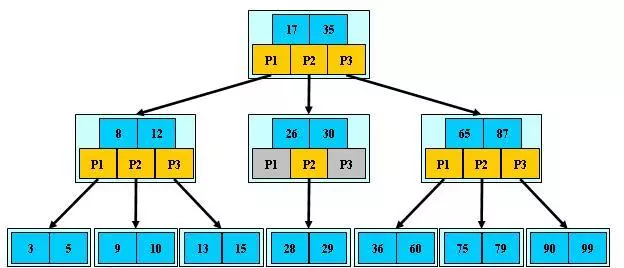
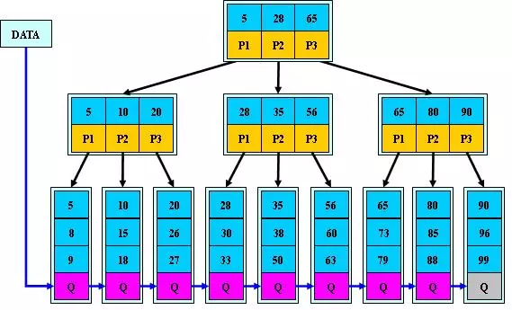

# 1、B-Tree(B树)

> B-Tree是一种多路搜索树（并不是二叉的）

## 1.1 定义

1. 定义任意非叶子结点最多只有M个儿子；且M>2；
2. 根结点的儿子数为[2, M]（2<=x<=M）；
3. 除根结点以外的非叶子结点的儿子数为[M/2, M]；
4. .每个结点存放至少M/2-1（取上整）和至多M-1个关键字；（至少2个关键字）
5. .非叶子结点的关键字个数=指向儿子的指针个数-1；
6. 非叶子结点的关键字：K[1], K[2], …, K[M-1]；且K[i] < K[i+1]；(按顺序)
7. 非叶子结点的指针：P[1], P[2], …, P[M]；其中P[1]指向关键字小于K[1]的
   子树，P[M]指向关键字大于K[M-1]的子树，其它P[i]指向关键字属于(K[i-1], K[i])的子树；
8. 所有叶子结点位于同一层；
9. 每个k对应一个data。

如：（M=3）相当于一个2–3树，2–3树是一个这样的一棵树， 它的每个节点要么有2个孩子和1个数据元素，要么有3个孩子和2个数据元素，叶子节点没有孩子，并且有1个或2个数据元素。



## 1.2 搜索

​	B-树的搜索，从根结点开始，对结点内的关键字（有序）序列进行**二分查找**，如果命中则结束，否则进入查询关键字所属范围的儿子结点；重复，直到所对应的儿子指针为空，或已经是叶子结点；B-Tree上查找算法的伪代码如下：

```java
BTree_Search(node, key) { 
  if(node == null) return null;
  foreach(node.key) {
    if(node.key[i] == key) return node.data[i]; 
    if(node.key[i] > key) return BTree_Search(point[i]->node); 
  }
  return BTree_Search(point[i+1]->node); 
} 
data = BTree_Search(root, my_key);
```

## 1.3 特性

1. 关键字集合分布在整颗树中；
2. 任何一个关键字出现且只出现在一个结点中；
3. 搜索有可能在非叶子结点结束；
4. 其搜索性能等价于在关键字全集内做一次二分查找；
5. 自动层次控制；

## 1.4 自控制

​	B树中每一个内部节点会包含一定数量的键值。通常，键值的数量被选定在d和2d之间。在实际中，键值占用了节点中大部分的空间。因数2将保证节点可以被拆分或组合。如果一个内部节点有2d个键值，那么添加一个键值给此节点的过程，将会拆分2d键值为2个d键值的节点，并把此键值添加给父节点。每一个拆分的节点需要最小数目的键值。相似地，如果一个内部节点和他的邻居两者都有d个键值，那么将通过它与邻居的合并来删除一个键值。删除此键值将导致此节点拥有d-1个键值;与邻居的合并则加上d个键值，再加上从邻居节点的父节点移来的一个键值。结果为完全填充的2d个键值。

## 1.5 B-树的构造过程：

下面是往B树中依次插入
6 10 4 14 5 11 15 3 2 12 1 7 8 8 6 3 6 21 5 15 15 6 32 23 45 65 7 8 6 5 4


# 2、B+Tree

> B-Tree有许多变种，其中最常见的是B+Tree，例如MySQL就普遍使用B+Tree实现其索引结构。

## 2.1 对比 B-Tree不同点

1. 非叶子结点的子树指针与关键字个数相同；
2. 非叶子结点的子树指针P[i]，指向关键字值属于[K[i], K[i+1])的子树（B-树是开区间）；
3. 为所有叶子结点增加一个链指针；
4. 内节点不存储data，只存储key
5. B+的搜索与B-树也基本相同，区别是B+树只有达到叶子结点才命中（B-树可以在非叶子结点命中），其性能也等价于在关键字全集做一次二分查找；



## 2.1 B+Tree 特性

- 所有关键字都出现在叶子结点的链表中（稠密索引），且链表中的关键字恰好是有序的；
- 不可能在非叶子结点命中；
- 非叶子结点相当于是叶子结点的索引（稀疏索引），叶子结点相当于是存储（关键字）数据的数据层；
- 更适合文件索引系统；

## 2.2 B+树构造过程

下面是往B+树中依次插入
6 10 4 14 5 11 15 3 2 12 1 7 8 8 6 3 6 21 5 15 15 6 32 23 45 65 7 8 6 5 4


