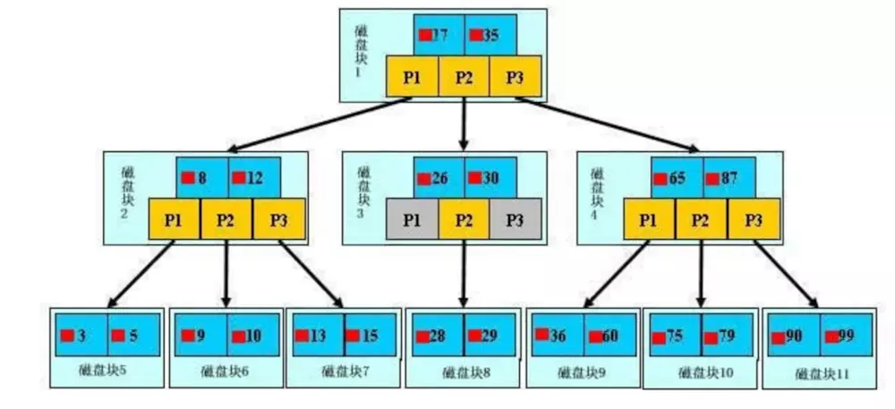
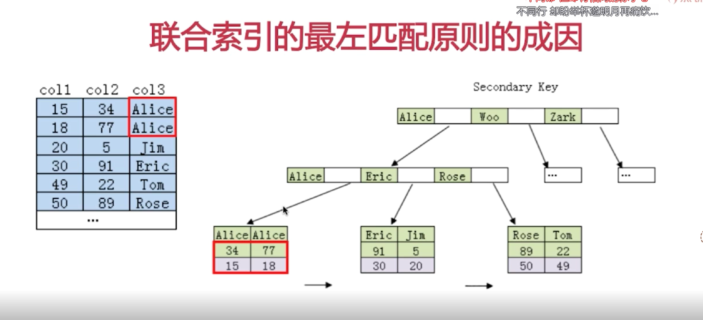

# 1 索引的物理存储

​	一般来说，索引本身也很大，不可能全部存储在内存中，因此索引往往以索引文件的形式存储的磁盘上。这样的话，索引查找过程中就要产生磁盘I/O消耗，相对于内存存取，I/O存取的消耗要高几个数量级，所以评价一个数据结构作为索引的优劣最重要的指标就是在查找过程中磁盘I/O操作次数的渐进复杂度。换句话说，索引的结构组织要尽量减少查找过程中磁盘I/O的存取次数。

# 2、B-Tree

假如每个盘块可以正好存放一个B树的结点（正好存放2个文件名）。那么一个BTNODE结点就代表一个盘块，而子树指针就是存放另外一个盘块的地址。

- 下面，咱们来模拟下查找文件29的过程：

1. 根据根结点指针找到文件目录的根磁盘块1，将其中的信息导入内存。【磁盘IO操作 1次】
2. 此时内存中有两个文件名17、35和三个存储其他磁盘页面地址的数据。根据算法我们发现：17<29<35，因此我们找到指针p2。
3. .根据p2指针，我们定位到磁盘块3，并将其中的信息导入内存。【磁盘IO操作 2次】
4. 此时内存中有两个文件名26，30和三个存储其他磁盘页面地址的数据。根据算法我们发现：26<29<30，因此我们找到指针p2。
5. 根据p2指针，我们定位到磁盘块8，并将其中的信息导入内存。【磁盘IO操作 3次】
6. 此时内存中有两个文件名28，29。根据算法我们查找到文件名29，并定位了该文件内存的磁盘地址。

分析上面的过程，发现需要3次磁盘IO操作和3次内存查找操作。**关于内存中的文件名查找，由于是一个有序表结构，可以利用折半查找提高效率。至于IO操作是影响整个B树查找效率的决定因素**。

# 3、B+Tree

## 3.1 B+Tree优点

- B+-tree的磁盘读写代价更低

  **B+-tree**的内部结点并没有指向关键字具体信息的指针。因此其内部结点相对B 树更小。如果把所有同一内部结点的关键字存放在同一盘块中，那么盘块所能容纳的关键字数量也越多。一次性读入内存中的需要查找的关键字也就越多。相对来说IO读写次数也就降低了。

  举个例子，假设磁盘中的一个盘块容纳16bytes，而一个关键字2bytes，一个关键字具体信息指针2bytes。一棵9阶B-tree(一个结点最多8个关键字)的内部结点需要2个盘块。而**B+**树内部结点只需要1个盘快。当需要把内部结点读入内存中的时候，B 树就比**B+ **树多一次盘块查找时间(在磁盘中就是盘片旋转的时间)。

- B+-tree的查询效率更加稳定

  由于非终结点并不是最终指向文件内容的结点，而只是叶子结点中关键字的索引。所以任何关键字的查找必须走一条从根结点到叶子结点的路。所有关键字查询的路径长度相同，导致每一个数据的查询效率相当。

# 4、最左匹配原则成因

mysql创建复合索引的规则是对最左边也就是第一个字段进行排序，然后在第一个字段排序的基础上在进行对第二个字段进行排序，所以第一个字段是绝对有序的，但是第二个就是无序的，所以直接使用第二个是不会使用索引的。

