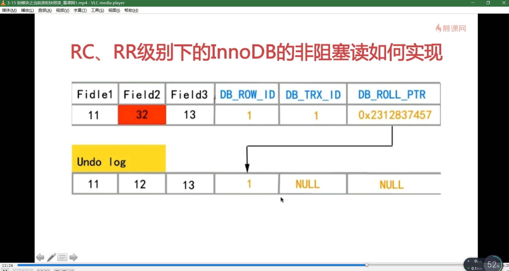
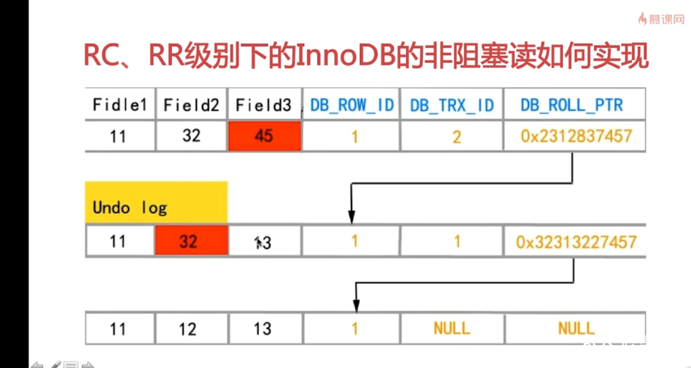
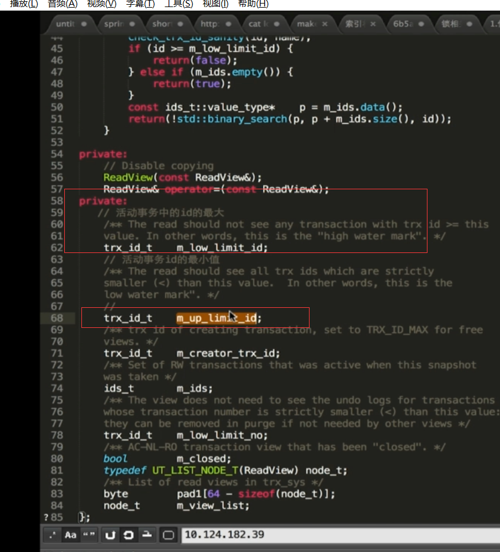

# 1、关系型数据库事务特性

**关系型数据库需要遵循ACID规则，具体内容如下：**


1. **A 原子性（Atomicity，不可分割性）：** 一个事务（transaction）中的所有操作，要么全部完成，要么全部不完成，不会结束在中间某个环节。事务在执行过程中发生错误，会被回滚（Rollback）到事务开始前的状态，就像这个事务从来没有执行过一样。
2. **C 一致性（Consistency）：** 在事务开始之前和事务结束以后，数据库的完整性没有被破坏。这表示写入的资料必须完全符合所有的预设规则，这包含资料的精确度、串联性以及后续数据库可以自发性地完成预定的工作。
3. **I 隔离性（Isolation 独立性）：** 数据库允许多个并发事务同时对其数据进行读写和修改的能力，隔离性可以防止多个事务并发执行时由于交叉执行而导致数据的不一致。事务隔离分为不同级别，包括读未提交（Read uncommitted）、读提交（read committed）、可重复读（repeatable read）和串行化（Serializable）。
4. **D 持久性（Durability）:**事务处理结束后，对数据的修改就是永久的，即便系统故障也不会丢失。

> 在 MySQL 命令行的默认设置下，事务都是自动提交的，即执行 SQL 语句后就会马上执行 COMMIT 操作。因此要显式地开启一个事务务须使用命令 BEGIN 或 START TRANSACTION，或者执行命令 SET AUTOCOMMIT=0，用来禁止使用当前会话的自动提交。

## 1.1 事务控制语句

- BEGIN 或 START TRANSACTION 显式地开启一个事务；
- COMMIT 也可以使用 COMMIT WORK，不过二者是等价的。COMMIT 会提交事务，并使已对数据库进行的所有修改成为永久性的；
- ROLLBACK 也可以使用 ROLLBACK WORK，不过二者是等价的。回滚会结束用户的事务，并撤销正在进行的所有未提交的修改；
- SAVEPOINT identifier，SAVEPOINT 允许在事务中创建一个保存点，一个事务中可以有多个 SAVEPOINT；
- RELEASE SAVEPOINT identifier 删除一个事务的保存点，当没有指定的保存点时，执行该语句会抛出一个异常；
- ROLLBACK TO identifier 把事务回滚到标记点
- SET TRANSACTION 用来设置事务的隔离级别。InnoDB 存储引擎提供事务的隔离级别有READ UNCOMMITTED、READ COMMITTED、REPEATABLE READ 和 SERIALIZABLE。

## 1.2 MYSQL 事务处理主要有两种方法：

1、用 BEGIN, ROLLBACK, COMMIT来实现

- **BEGIN** 开始一个事务
- **ROLLBACK** 事务回滚
- **COMMIT** 事务确认

2、直接用 SET 来改变 MySQL 的自动提交模式:

- **SET AUTOCOMMIT=0** 禁止自动提交
- **SET AUTOCOMMIT=1** 开启自动提交

```mysql
mysql> use RUNOOB;
Database changed
mysql> CREATE TABLE runoob_transaction_test( id int(5)) engine=innodb; # 创建数据表
Query OK, 0 rows affected (0.04 sec)
mysql> select * from runoob_transaction_test;
Empty set (0.01 sec)
mysql> begin; # 开始事务
Query OK, 0 rows affected (0.00 sec)
mysql> insert into runoob_transaction_test value(5);
Query OK, 1 rows affected (0.01 sec)
mysql> insert into runoob_transaction_test value(6);
Query OK, 1 rows affected (0.00 sec)
mysql> commit; # 提交事务
Query OK, 0 rows affected (0.01 sec)
mysql> select * from runoob_transaction_test;
+------+
| id |
+------+
| 5 |
| 6 |
+------+
2 rows in set (0.01 sec)
mysql> begin; # 开始事务
Query OK, 0 rows affected (0.00 sec)
mysql> insert into runoob_transaction_test values(7);
Query OK, 1 rows affected (0.00 sec)
mysql> rollback; # 回滚
Query OK, 0 rows affected (0.00 sec)
mysql> select * from runoob_transaction_test; # 因为回滚所以数据没有插入
+------+
| id |
+------+
| 5 |
| 6 |
+------+
2 rows in set (0.01 sec)
mysql>
```

# 2、事务隔离级别

SQL标准定义了4类隔离级别，包括了一些具体规则，用来限定事务内外的哪些改变是可见的，哪些是不可见的。**低级别的隔离级一般支持更高的并发处理，并拥有更低的系统开销**。

- Read Uncommitted（读取未提交内容）

  在该隔离级别，所有事务都可以看到其他未提交事务的执行结果。本隔离级别很少用于实际应用，因为它的性能也不比其他级别好多少。读取未提交的数据，也被称之为脏读（Dirty Read）。


- Read Committed（读取提交内容）

  这是大多数数据库系统的默认隔离级别（但不是MySQL默认的）。它满足了隔离的简单定义：一个事务只能看见已经提交事务所做的改变。这种隔离级别 也支持所谓的不可重复读（Nonrepeatable Read），因为同一事务的其他实例在该实例处理其间可能会有新的commit，所以同一select可能返回不同结果。


- Repeatable Read（可重读）

  这是MySQL的默认事务隔离级别，它确保同一事务的多个实例在并发读取数据时，会看到同样的数据行。不过理论上，这会导致另一个棘手的问题：幻读 （Phantom Read）。简单的说，幻读指当用户读取某一范围的数据行时，另一个事务又在该范围内插入了新行，当用户再读取该范围的数据行时，会发现有新的“幻影” 行。InnoDB和Falcon存储引擎通过**多版本并发控制**（MVCC，Multiversion Concurrency Control）机制解决了该问题。


- Serializable（可串行化）

  这是最高的隔离级别，它通过强制事务排序，使之不可能相互冲突，从而解决幻读问题。简言之，它是在每个读的数据行上加上共享锁。在这个级别，可能导致大量的超时现象和锁竞争。

​      事务隔离机制的实现基于锁机制和并发调度。其中并发调度使用的是MVVC（多版本并发控制），通过保存修改的旧版本信息来支持并发一致性读和回滚等特性。

**这四种隔离级别采取不同的锁类型来实现，若读取的是同一个数据的话，就容易发生问题。例如：**

- 脏读(Drity Read)：某个事务已更新一份数据，另一个事务在此时读取了同一份数据，由于某些原因，前一个RollBack了操作，则后一个事务所读取的数据就会是不正确的。
- 不可重复读(Non-repeatable read):在一个事务的两次查询之中数据不一致，这可能是两次查询过程中间插入了一个事务更新的原有的数据。
- 幻读(Phantom Read):在一个事务的两次查询中数据笔数不一致，例如有一个事务查询了几列(Row)数据，而另一个事务却在此时插入了新的几列数据，先前的事务在接下来的查询中，就会发现有几列数据是它先前所没有的。

| 隔离级别                   | 脏读   | 不可重复读 | 幻读   |
| ---------------------- | ---- | ----- | ---- |
| 读未提交(Read Uncommitted) | yes  | yes   | yes  |
| 读已提交(Read Committed)   | no   | yes   | yes  |
| 可重复读(Repeatable Read)  | no   | no    | yes  |
| 可串行化(Serializable)     | no   | no    | no   |

## 设置当前隔离级别

```mysql
-- 取消autocommit
set autocommit=0
show variables like "%autocommit%";
 
-- 查看隔离级别
SELECT @@global.tx_isolation;
SELECT @@session.tx_isolation;
SELECT @@tx_isolation;
 
show variables like '%iso%';
+---------------+-----------------+
| Variable_name | Value           |
+---------------+-----------------+
| tx_isolation  | REPEATABLE-READ |
+---------------+-----------------+
 
show global variables like '%iso%';
+---------------+-----------------+
| Variable_name | Value           |
+---------------+-----------------+
| tx_isolation  | REPEATABLE-READ |
+---------------+-----------------+
 
-- 设置隔离级别
SET SESSION TRANSACTION ISOLATION LEVEL read uncommitted;
SET SESSION TRANSACTION ISOLATION LEVEL read committed;
SET SESSION TRANSACTION ISOLATION LEVEL repeatable read;
SET SESSION TRANSACTION ISOLATION LEVEL serializable;
 
-- 事务操作
start transaction;
SELECT * FROM text.tx;
commit;
 
start transaction;
SELECT * FROM text.tx;
update text.tx set num =10 where id = 1;
insert into text.tx(id,num) values(9,9);
rollback;
commit;
```

## 配置文件

```mysql
# MySQL支持4种事务隔离级别，他们分别是：
# READ-UNCOMMITTED, READ-COMMITTED, REPEATABLE-READ, SERIALIZABLE.
# 如没有指定，MySQL默认采用的是REPEATABLE-READ，ORACLE默认的是READ-COMMITTED
transaction_isolation = REPEATABLE-READ
```

# 3、RC、RR级别下的InnoDB的非阻塞读（快照读）如何实现

**① 数据行里DB_TRX_ID、DB_ROLL_PTR、DB_ROW_ID字段**

DB_TRX_ID:记录最后一次数据修改的事务ID。

DB_ROLL_PTR: 即回滚指针，写入回滚段ROLLBACK segment的undo 日志记录。如果一行记录被更新，则undo log record 包含重建该行记录被更新之前内容所必需的信息。

DB_ROW_ID: 行号，包含一个随着新行插入而单调递增的行id，当由InnoDB自动产生聚集索引时，聚集索引会包括这个行ID的值，否则这个行id不会出现在任何索引中。当Innodb的表既没有主键也没有唯一键的话，innodb会自动创建一个自增的隐藏主键字段，即这个DB_ROW_ID;

**② undo日志**

当对数据做了变更操作时，就会产生undo记录，存储老版数据，当一个旧的事务需要读取数据时，为了能读取到老版本的数据，需要顺着undo链找到满足其可见性的记录。

分为两种 insert undo log ,update undo log。insert undo log 指事务对insert新纪录产生的undo log ，只在事务回滚时需要，并且在事务提交后既可以丢弃。update undo log ,事务对数据进行update、delete时产生的undo log ，不仅在事务回滚时需要，快照读也需要，不能随便删除，只有数据库所使用的快照中不涉及该日志记录，对应的回滚日志才会被perg线程删除。





**③ read view**

主要是用来做可见性判断，即当我们执行快照读select时，会针对查询的数据创建一个read view ，来决定当前事务能看到那个版本的数据，有可能是当前版本的数据，也有可能是只允许看undo log中某个版本的数据。read view 遵循一个可见性算法，主要是将要修改的数据的DB_TRX_ID取出与系统其他活跃事务做对比，如果大于或者等于，就通过DB_ROLL_PRT 指针取出undo log上一层的 DB_TRX_ID 知道小于这些活跃事务ID为止。




**④ 总结**

正因为以上的三个因子，才使得Innodb在RC以及RR下支持非堵塞读，而读取数据时的非堵塞就是所谓的MVCC,而Innodb的非阻塞读机制实现了仿照版（伪MVCC）MVCC（多版本并发控制）读不加锁，读写不冲突。之所以说是伪MVCC因为并没有实现核心的多版本共存。undo log中只是串行化的结果，记录了多个事务的过程，不属于多版本共存。

正是因为生成时机的不同，造成了RC、RR两种隔离级别的不同可见性，在REPEATABLE-READ 级别下，session在start transaction后的第一条快照度，即read view将当前系统中活跃的其他事物记录起来，此后在调用快照度时还是用这个read view.而在RC级别下事务中每条select语句都会创建一个新的快照，这也是为什么在RC下能用快照读看到其他事物的增删改。而在RR下如果首次使用快照度是在其他事物增删改之前，此后即使其他事物对数据进行增删改，RR级别下的事务也看不到最新结果。

对于RR来讲首次快照度的时机是非常重要的。


# 4、InnoDB可重复读隔离级别下如何避免幻读

**① 表象 ：快照读（非阻塞读）--伪MVCC机制**  如果早于要更新的事务打开read view 时不论别的事务的变更是否已提交，在当前事务内再次调用快照读时还是读的可见性版本内的数据

**② 内在: 是因为对数据加了next-key锁（行锁+gap锁） ** Gap 锁 即间隙锁，锁定一个范围但不包括记录本身，gap锁的目的是为了防止同一事物的两次当前读出现幻读的情况。在RC 及以下没有gap锁。所以RC以及RC下无法避免幻读的原因。而在RR以及SERIABLE下支持。

## 4.1 GAP锁出现的场景

在RR下无论删改查，当前读如用到主键或者唯一索引：

①如果where条件（范围查询、精确查询）全部命中，则不会使用GAP锁，只会加记录锁（行锁）

比如使用 select * from tablewhere id in (1,3,5);此时id 为1,3,5的数据均在table已存在并出现，则全部命中，如果只出现1,3并没有出现5则为部分命中。

②如果where条件（范围查询、精确查询）部分命中或者全不命中，则会加gap锁

③用在非唯一索引或不走索引的当前读中

## 4.2 GAP如何加

如果一个索引中包含值 10、11、13和20，则gap分布为 （-&，10],(10,11],(11,13],(13,20],(20,+&); 左开右闭 主要用来防止插入的。对要修改的周边上锁。对于临届点比如10 11的插入，需要与主键进行组合，如果主键位于10-11之外  则不会被阻塞。

不走索引的话该表的所有gap均会被锁住，类似锁住表。这种情况通常需要避免。

