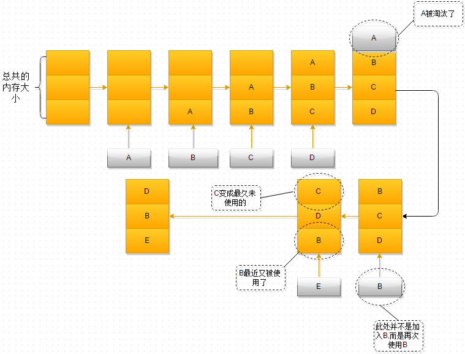

**Redis 中采用两种算法进行内存回收，引用计数算法以及LRU算法**

# 1、LRU算法

## 1.1 什么是LRU算法

LRU算法作为内存管理的一种有效算法,其含义是在内存有限的情况下，当内存容量不足时，为了保证程序的运行，这时就不得不淘汰内存中的一些对象，释放这些对象占用的空间，那么选择淘汰哪些对象呢？LRU算法就提供了一种策略，告诉我们选择最近一段时间内，最久未使用的对象将其淘汰，至于为什么要选择最久未使用的，可以想想，最近一段时间内使用的东西，我们是不是可能一会又要用到呢~，而很长一段时间内都没有使用过的东西，也许永远都不会再使用~

在操作系统中LRU算法淘汰的不是内存中的对象，而是页,当内存中数据不足时，通过LRU算法，选择一页(一般是4KB)将其交换到虚拟内存区(Swap区)

LRU算法演示

1. 最开始时，内存空间是空的，因此依次进入A、B、C是没有问题的
2. 当加入D时，就出现了问题，内存空间不够了，因此根据LRU算法，内存空间中A待的时间最为久远，选择A,将其淘汰
3. 当再次引用B时，内存空间中的B又处于活跃状态，而C则变成了内存空间中，近段时间最久未使用的
4. 当再次向内存空间加入E时，这时内存空间又不足了，选择在内存空间中待的最久的C将其淘汰出内存，这时的内存空间存放的对象就是E->B->D

# 2、引用计数算法

## 2.1 什么是引用计数算法

直白一点，就是对于创建的每一个对象都有一个与之关联的计数器，这个计数器记录着该对象被使用的次数，垃圾收集器在进行垃圾回收时，对扫描到的每一个对象判断一下计数器是否等于0，若等于0，就会释放该对象占用的内存空间,同时将该对象引用的其他对象的计数器进行减一操作

## 2.2 实现方式

两种实现方式

侵入式与非侵入性，引用计数算法的垃圾收集一般有侵入式与非侵入式两种，侵入式的实现就是将引用计数器直接根植在对象内部，用C++的思想进行解释就是，在对象的构造或者拷贝构造中进行加一操作，在对象的析构中进行减一操作，非侵入式恩想就是有一块单独的内存区域，用作引用计数器

## 2.3 优点

算法的优点

使用引用计数器,内存回收可以穿插在程序的运行中，在程序运行中，当发现某一对象的引用计数器为0时，可以立即对该对象所占用的内存空间进行回收，这种方式可以避免FULL GC时带来的程序暂停，

## 2.4 缺点

采用引用计数器进行垃圾回收，最大的缺点就是不能解决循环引用的问题，例如一个父对象持有一个子对象的引用，子对象也持有父对象的引用，这种情况下，父子对象将一直存在于JVM的堆中，无法进行回收
