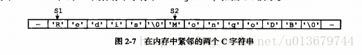
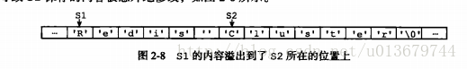
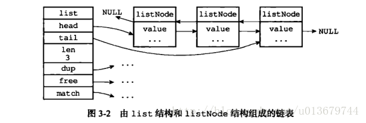
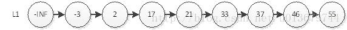
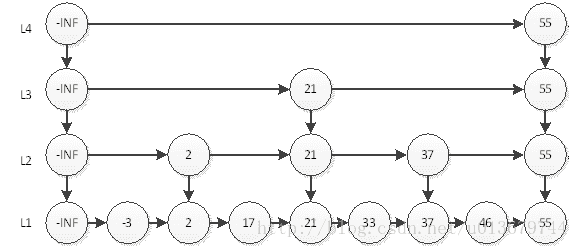
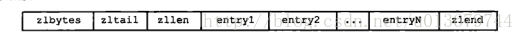

# 1、Redis 五种数据结构 图解


首先Redis内部使用一个redisObject对象来表示所有的key和value，redisObject最主要的信息如上图所示：type代表一个value对象具体是何种数据类型，encoding是不同数据类型在redis内部的存储方式，比如：type=string代表value存储的是一个普通字符串，那么对应的encoding可以是raw或者是int，如果是int则代表实际redis内部是按数值型类存储和表示这个字符串的，当然前提是这个字符串本身可以用数值表示，比如:"123" "456"这样的字符串。

​    这里需要特殊说明一下vm字段，只有打开了Redis的虚拟内存功能，此字段才会真正的分配内存，该功能默认是关闭状态的。

> type 命令实际返回的就是当前键的数据类型，他们分别是String(字符串)、hash(哈希)、list(列表)、set(集合)、zset(有序集合)，但是这些只是Redis对外的数据结构

  Redis的具有很多优势：

（1）读写性能高--100000次/s以上的读速度，80000次/s以上的写速度；

（2）K-V，value支持的数据类型很多：字符串(String)，队列（List）,哈希（Hash），集合（Sets），有序集合（Sorted Sets）5种不同的数据类型。

（3）原子性，Redis的所有操作都是单线程原子性的。

（4）特性丰富--支持订阅-发布模式，通知、设置key过期等特性。

（5）在Redis3.0 版本引入了Redis集群，可用于分布式部署。


# 2、简单动态字符串（simple dynamic string sds）

String的数据类型是由SDS实现的。Redis并没有采用C语言的字符串表示，而是自己构建了一种名为SDS的抽象类型，并将SDS作为Redis的默认字符串表示。

注意：SDS除了用于实现字符串类型，还被用作AOF持久化时的缓冲区。

SDS的定义为：

```
/*  
 * 保存字符串对象的结构  
 */ 
struct sdshdr {  

// buf 中已占用空间的长度  

int len;  

// buf 中剩余可用空间的长度  

int free;  

// 数据空间  

char buf[];  
}
```

为什么要使用SDS：

我们一定会思考，redis为什么不使用C语言的字符串而是费事搞一个SDS呢，这是因为C语言用N+1的字符数组来表示长度为N的字符串，这样做在获取字符串长度，字符串扩展等操作方面效率较低，并且无法满足redis对字符串在安全性、效率以及功能方面的要求。

获取字符串长度（SDS O（1））在C语言字符串中，为了获取一个字符串的长度，必须遍历整个字符串，时间复杂度为O(1)，而SDS中，有专门用于保存字符串长度的变量，所以可以在O（1）时间内获得。

**防止缓冲区溢出**

C字符串，容易导致缓冲区溢出，假设在程序中存在内存紧邻的字符串s1和s2，s1保存redis，s2保存MongoDB，如下图：



如果我们现在将s1 的内容修改为redis cluster，但是又忘了重新为s1 分配足够的空间，这时候就会出现以下问题：



  因为s1和s2是紧邻的，所以原本s2 中的内容已经被S1的内容给占领了，s2 现在为 cluster，而不是“Mongodb”。而Redis中的SDS就杜绝了发生缓冲区溢出的可能性。

当我们需要对一个SDS 进行修改的时候，redis 会在执行拼接操作之前，**预先检查给定SDS 空间是否足够（free记录了剩余可用的数据长度）**，如果不够，会先拓展SDS 的空间，然后再执行拼接操作。

**减少扩展或收缩字符串带来的内存重分配次数**

当字符串进行扩展或收缩时，都会对内存空间进行重新分配。

1. 字符串拼接会产生字符串的内存空间的扩充，在拼接的过程中，原来的字符串的大小很可能小于拼接后的字符串的大小，那么这样的话，就会导致一旦忘记申请分配空间，就会导致内存的溢出。
2. 字符串在进行收缩的时候，内存空间会相应的收缩，而如果在进行字符串的切割的时候，没有对内存的空间进行一个重新分配，那么这部分多出来的空间就成为了内存泄露。
3. 比如：字符串"redis"，当进行字符串拼接时，将redis+cluster=13，会将SDS的长度修改为13，同时将free也改为13，这意味着进行预分配了，将buffer大小变为了26。这是为了如果再次执行字符串拼接操作，如果拼接的字符串长度<13,就不需要重新进行内存分配了。
4. 通过这种预分配策略，SDS将连续增长N次字符串所需的内存重分配次数从必定N次降低为最多N次。通过惰性空间释放，SDS 避免了缩短字符串时所需的内存重分配操作，并未将来可能有的增长操作提供了优化。

二进制安全


    C 字符串中的字符必须符合某种编码，并且除了字符串的末尾之外，字符串里面不能包含空字符，否则最先被程序读入的空字符将被误认为是字符串结尾，这些限制使得C字符串只能保存文本数据，而不能保存想图片，音频，视频，压缩文件这样的二进制数据。

　但是在Redis中，不是靠空字符来判断字符串的结束的，而是通过len这个属性。那么，即便是中间出现了空字符对于SDS来说，读取该字符仍然是可以的。

但是，SDS依然可以兼容部分C字符串函数。

# 3、链表

链表是list的实现方式之一。当list包含了数量较多的元素，或者列表中包含的元素都是比较长的字符串时，Redis会使用链表作为实现List的底层实现。此链表是双向链表：

一般我们通过操作list来操作链表：

```
typedef struct list{
    //表头节点
    listNode  * head;
    //表尾节点
    listNode  * tail;
    //链表长度
    unsigned long len;
    //节点值复制函数
    void *(*dup) (void *ptr);
    //节点值释放函数
    void (*free) (void *ptr);
    //节点值对比函数
    int (*match)(void *ptr, void *key);
}
```



链表结构的特点是可以快速的在表头和表尾插入和删除元素，但查找复杂度高，是列表的底层实现之一，也因此列表没有提供判断某一元素是否在列表中的借口，因为在链表中查找复杂度高。

# 4、字典

字典，又称为符号表（symbol table）、关联数组（associative array）或映射（map），是一种用于保存键值对的抽象数据结构。　

在字典中，一个键（key）可以和一个值（value）进行关联，字典中的每个键都是独一无二的。在C语言中，并没有这种数据结构，但是Redis 中构建了自己的字典实现。

Redis本身的K-V存储就是利用字典这种数据结构的，另外value类型的哈希表也是通过这个实现的。

哈希表dicy的定义为：

```
typedef struct dictht {
   //哈希表数组
   dictEntry **table;
   //哈希表大小
   unsigned long size;
 
   //哈希表大小掩码，用于计算索引值
   unsigned long sizemask;
   //该哈希表已有节点的数量
   unsigned long used;
}
```

我们可以想到对比Java hashMap的实现方式，在dictht中，table数组的类型是：

```
typeof struct dictEntry{
   //键
   void *key;
   //值
   union{
      void *val;
      uint64_tu64;
      int64_ts64;
   }
   struct dictEntry *next;
 
}
```

我们存入里面的key 并不是直接的字符串，而是一个hash 值，通过hash 算法，将字符串转换成对应的hash 值，然后在dictEntry 中找到对应的位置。

这时候我们会发现一个问题，如果出现hash 值相同的情况怎么办？Redis 采用了链地址法来解决hash冲突。这与hashmap的实现类似。

注意：Redis又在dictht的基础上，又抽象了一层字典dict，其定义为：

```
typedef struct dict {
    // 类型特定函数
    dictType *type;
    // 私有数据
    void *privedata;
    // 哈希表
    dictht  ht[2];
    // rehash 索引
    in trehashidx;
 
}
```

# 5、跳跃表

Redis 只在两个地方用到了跳跃表，一个是实现有序集合键（sorted Sets），另外一个是在集群节点中用作内部数据结构。

其实跳表主要是来替代平衡二叉树的，比起平衡树来说，跳表的实现要简单直观的多。

跳跃表（skiplist）是一种有序数据结构，它通过在每个节点中维持多个指向其他节点的指针，从而达到快速查找访问节点的目的。跳跃表是一种随机化的数据,跳跃表以有序的方式在层次化的链表中保存元素，效率和平衡树媲美 ——查找、删除、添加等操作都可以在O（logn）期望时间下完成。

Redis 的跳跃表 主要由两部分组成：zskiplist（链表）和zskiplistNode （节点）：

```
typedef struct zskiplistNode{
　　　//层
     struct zskiplistLevel{
　　　　　//前进指针
        struct zskiplistNode *forward;
　　　　//跨度
        unsigned int span;
    } level[];
　　//后退指针
    struct zskiplistNode *backward;
　　//分值
    double score;
　　//成员对象
    robj *obj;
}
```

1、层：level 数组可以包含多个元素，每个元素都包含一个指向其他节点的指针。level数组的每个元素都包含：前进指针：用于指向表尾方向的前进指针，跨度：用于记录两个节点之间的距离
2、后退指针：用于从表尾向表头方向访问节点

3、分值和成员：跳跃表中的所有节点都按分值从小到大排序（按照这个进行排序的，也就是平衡二叉树（搜索树的）的节点大小）。成员对象指向一个字符串，这个字符串对象保存着一个SDS值（实际存储的值）

- 　跳跃表是有序集合的底层实现之一
-    在同一个跳跃表中，多个节点可以包含相同的分值，但每个节点的对象必须是唯一的
-    节点按照分值的大小从大到小排序，如果分值相同，则按成员对象大小排序

**怎么使用跳表来实现O（logn）的增删改查？？**

其实跳表的实现原理，我们可以结合二分法来看。



比如上图，我们要查找55，如果通过遍历，则必须得从头遍历到最后一个才能找到，所以在数组实现中，我们可以使用二分法来实现，但是在链表中，我们没办法直接通过下标来访问元素，所以一般我们可以用二叉搜索树，平衡树来存储元素，我们知道跳表就是来替代平衡树的，那么跳表是如何快速查询呢？看下图：



从上图我们可以看到，我们通过第4层，只需一步便可找到55，另外最耗时的访问46需要6次查询。即L4访问55，L3访问21、55，L2访问37、55，L1访问46。我们直觉上认为，这样的结构会让查询有序链表的某个元素更快。这种实现方式跟二分很相似，其时间复杂度就是O(logn)。其插入，删除都是O（logn）。

我们可以看到，redis正是通过定义这种结构来实现上边的过程，其层数最高为32层，也就是他可以存储2^32次方的数据，其查找过程与上图很类似。

# 6、整数集合（Intset）

整数集合是集合建(sets)的底层实现之一，当一个集合中只包含整数，且这个集合中的元素数量不多时，redis就会使用整数集合intset作为集合的底层实现。

我们可以这样理解整数集合，他其实就是一个特殊的集合，**里面存储的数据只能够是整数，并且数据量不能过大**。

```
typedef struct intset{
    //编码方式
    uint32_t enconding;
   // 集合包含的元素数量
    uint32_t length;
    //保存元素的数组    
    int8_t contents[];
 
} 
```

整数集合是集合建的底层实现之一.



整数集合的底层实现为数组，这个数组以有序，无重复的范式保存集合元素，在有需要时，程序会根据新添加的元素类型改变这个数组的类型.

　　1、zlbytes:用于记录整个压缩列表占用的内存字节数

　　2、zltail：记录要列表尾节点距离压缩列表的起始地址有多少字节

　　3、zllen：记录了压缩列表包含的节点数量。

　　4、entryX：要说列表包含的各个节点

　　5、zlend：用于标记压缩列表的末端

　　　　

压缩列表是一种为了节约内存而开发的顺序型数据结构

压缩列表被用作列表键和哈希键的底层实现之一

压缩列表可以包含多个节点，每个节点可以保存一个字节数组或者整数值

添加新节点到压缩列表，可能会引发连锁更新操作。

